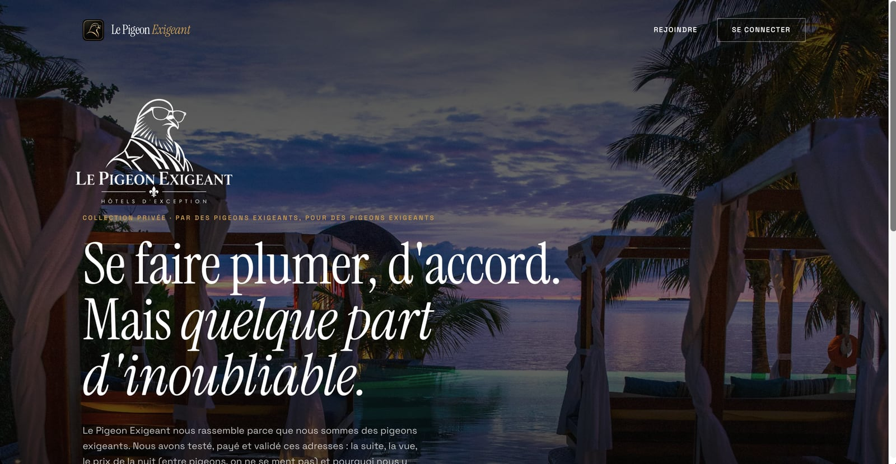
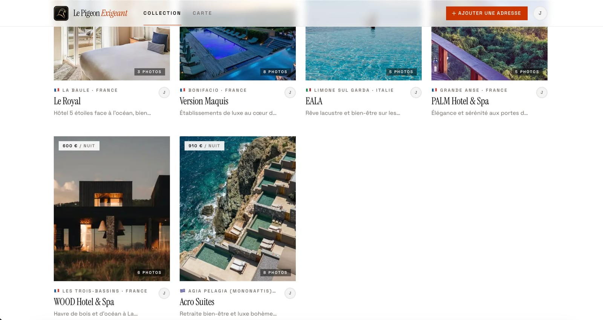
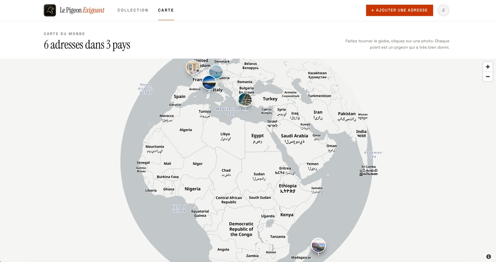
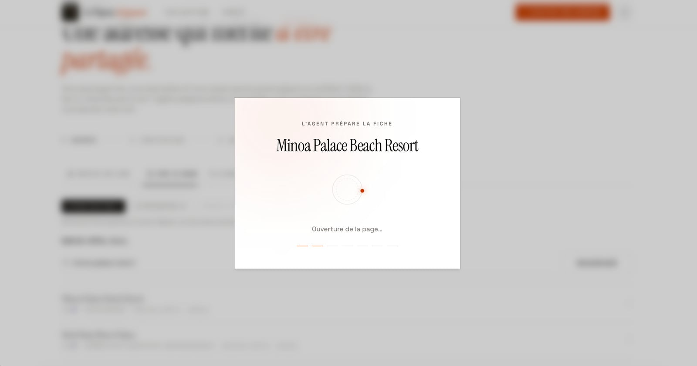
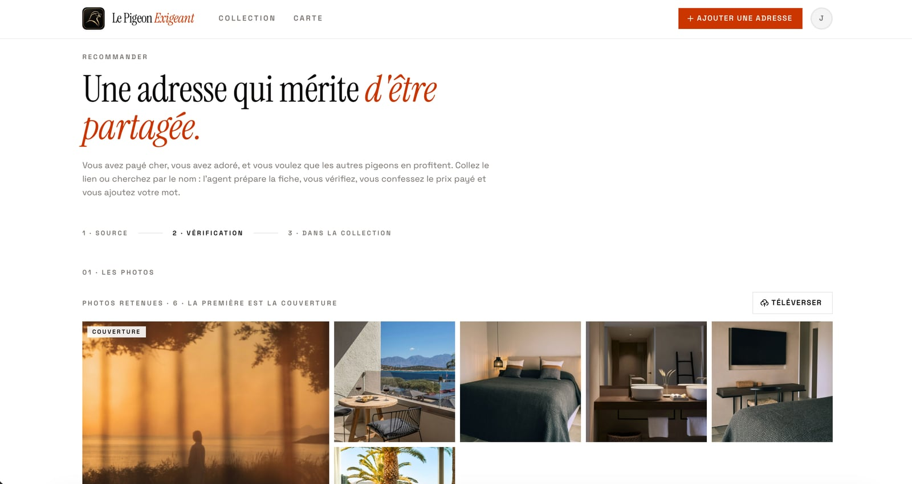

<p align="center">
  
  
</p>

<h1 align="center">Le Pigeon Exigeant</h1>

<p align="center">
  <strong>La collection privée d'hôtels d'exception, partagée entre couples et amis qui y ont vraiment dormi.</strong><br>
  Sur invitation. Le prix réellement payé. Aucun algorithme, aucun sponsor.
</p>

<p align="center">
  <a href="https://lepigeonexigeant.fr"></a>
  
  
  
  
  
  
  
  <a href="LICENSE"></a>
  
</p>

---

> [!WARNING]
> **Contenus extraits, droits des hôtels et responsabilité.** La fonction « depuis un lien » lit une page web publique et en propose la description, la localisation et les photos. Ces textes et images restent la **propriété de l'hôtel** ou de leurs auteurs. Le projet est conçu pour une **collection privée, non commerciale, entre membres invités** ; il ne vous autorise en rien à republier, revendre ou exploiter ces contenus. Vérifiez les conditions d'utilisation du site source, préférez vos propres photos dès que possible, et retirez toute adresse sur demande de son propriétaire. Vous êtes seul responsable de l'usage que vous faites de votre instance et des contenus que vous y importez.

## Qu'est-ce que c'est ?

**Le Pigeon Exigeant** est une petite plateforme privée où des couples et des amis partagent et gèrent les hôtels et maisons d'exception qu'ils recommandent. Chaque adresse est ajoutée par un membre qui y a séjourné, avec ses photos, sa localisation, le prix qu'il a réellement payé par nuit, le mois du séjour, sa note et un mot pour les autres.

Ce n'est ni un comparateur ni un moteur de réservation : c'est une collection. On y entre sur invitation, ou en sollicitant un accès. Le ton est volontairement décalé (« se faire plumer, d'accord, mais quelque part d'inoubliable »), le design éditorial, l'interface en français.

### Ce que l'on peut faire

- **Parcourir la collection** par pays puis par ville, rechercher un nom, ouvrir une fiche avec galerie plein écran.
- **Voir la carte du monde** en projection globe, chaque adresse représentée par sa photo.
- **Ajouter une adresse en quelques secondes** :
  - depuis un lien : un agent lit la page de l'hôtel, en extrait la description, la localisation et les photos (OpenAI), puis vous vérifiez ;
  - par le nom : recherche OpenStreetMap gratuite d'abord, IA en dernier recours et derrière un garde-fou humoristique ; le site officiel est retrouvé puis extrait automatiquement ;
  - à la main, avec vos propres photos.
- **Confesser le prix payé**, choisir le mois du séjour, noter, laisser un mot.
- **Gérer ses adresses** : modifier, supprimer, réordonner les photos, choisir la couverture.
- **Rejoindre sur invitation**, demander un accès sans code, réinitialiser son mot de passe. Les e-mails sont soignés (React Email + Resend).

## Captures

| Accueil | Collection |
| --- | --- |
|  |  |

| Carte du monde | L'agent prépare la fiche |
| --- | --- |
|  |  |

| Vérification avant publication |
| --- |
|  |

## Stack

| Couche | Choix | Version |
| --- | --- | --- |
| Framework | [Next.js](https://nextjs.org) App Router, React Server Components, Turbopack | 16.3 / React 19.2 |
| UI | [shadcn/ui](https://ui.shadcn.com) (preset Base UI), Tailwind CSS, Hugeicons, Instrument Serif + Space Grotesk | Tailwind 4 |
| Authentification | [BetterAuth](https://www.better-auth.com) (e-mail + mot de passe, réinitialisation, adaptateur Drizzle) | 1.7 |
| Base de données | PostgreSQL via [Drizzle ORM](https://orm.drizzle.team) — Docker en local, [Neon](https://neon.tech) en production | Drizzle 0.45 |
| IA | [OpenAI Responses API](https://platform.openai.com) : extraction structurée, recherche web | openai 7 |
| Recherche libre | [Photon](https://photon.komoot.io) et [Nominatim](https://nominatim.org) (OpenStreetMap), Google Places en option | — |
| Carte | [MapLibre GL](https://maplibre.org) + tuiles [OpenFreeMap](https://openfreemap.org), projection globe | MapLibre 5 |
| Photos | [sharp](https://sharp.pixelplumbing.com) (WebP, redimensionnement) + [Vercel Blob](https://vercel.com/storage/blob) en production, disque local en dev | — |
| E-mails | [Resend](https://resend.com) + [React Email](https://react.email) | resend 6 |
| Hébergement | [Vercel](https://vercel.com) | — |

## Démarrer en local

Prérequis : Node.js 20.9 ou plus (`.nvmrc` propose la 22), Docker.

```bash
git clone <ce dépôt> && cd bookrich
cp .env.example .env
npm install
npm run setup        # Postgres Docker + migrations + votre compte
npm run dev          # http://localhost:3000
```

Avant `npm run setup`, éditez `.env` :

- `BETTER_AUTH_SECRET` : `openssl rand -base64 32`
- `SEED_USER_EMAIL`, `SEED_USER_NAME` : votre compte. Laissez `SEED_USER_PASSWORD` vide pour qu'un mot de passe soit généré et affiché une seule fois.
- `INVITE_CODE` : le code que vous transmettrez aux invités.
- `OPENAI_API_KEY` : sans elle, l'extraction fonctionne en mode dégradé (métadonnées de la page) et la recherche IA est désactivée ; OpenStreetMap reste disponible.

Les photos sont stockées dans `storage/uploads` tant que `BLOB_READ_WRITE_TOKEN` est vide. Sans `RESEND_API_KEY`, les e-mails ne partent pas : le lien de réinitialisation s'affiche dans la console serveur.

### Scripts

| Commande | Effet |
| --- | --- |
| `npm run dev` / `build` / `start` | Développement, build de production, serveur de production |
| `npm run typecheck` / `lint` / `format` | Qualité |
| `npm run db:up` / `db:down` | Postgres Docker |
| `npm run db:generate` / `db:migrate` | Générer puis appliquer une migration Drizzle |
| `npm run db:seed` | Créer le compte défini par `SEED_USER_*` |
| `npm run db:seed:hotels` | Quatre adresses fictives, attribuées à ce compte |
| `npm run user:invite -- <email> <prénom>` | Inviter un membre (mot de passe généré ou `--password …`) |
| `npm run db:clean` | Vider la collection et les photos locales, conserver les comptes |
| `npm run db:reset` | Supprimer le schéma, migrer, recréer le compte |
| `npm run deploy` / `deploy:prod` | Déployer sur Vercel (voir ci-dessous) |

`db:clean` et `db:reset` refusent une URL Neon sans `--force`.

## Configuration

Toutes les variables sont documentées dans [`.env.example`](.env.example).

| Variable | Rôle | Obligatoire |
| --- | --- | --- |
| `DATABASE_URL` | PostgreSQL (Docker en local, URL *pooled* Neon en prod, `sslmode=verify-full`) | oui |
| `BETTER_AUTH_SECRET` | Secret de signature des sessions | oui |
| `BETTER_AUTH_URL` | URL publique du site en production ; vide en local | prod |
| `NEXT_PUBLIC_SITE_URL` | URL canonique (SEO, e-mails) | prod |
| `INVITE_CODE` | Code exigé à l'inscription ; vide = inscription ouverte | conseillé |
| `OPENAI_API_KEY`, `OPENAI_MODEL` | Extraction et recherche IA (`gpt-5-mini` par défaut) | non |
| `GOOGLE_PLACES_API_KEY` | Fournisseur de recherche supplémentaire | non |
| `BLOB_READ_WRITE_TOKEN` | Vercel Blob pour les photos | prod |
| `RESEND_API_KEY`, `RESEND_FROM`, `RESEND_REPLY_TO` | Envoi des e-mails | prod |
| `ACCESS_REQUEST_NOTIFY_EMAIL` | Reçoit chaque demande d'accès | non |
| `NEXT_PUBLIC_AUTHOR_NAME`, `NEXT_PUBLIC_AUTHOR_URL` | Signature « Fait avec ♥ par … » dans les pieds de page | non |
| `SEED_USER_EMAIL`, `SEED_USER_PASSWORD`, `SEED_USER_NAME` | Compte créé par `db:seed` | local |

## Déployer

Le projet tourne sur **Vercel** avec **Neon** (PostgreSQL), **Vercel Blob** (photos) et **Resend** (e-mails). Tout autre hébergeur Node.js avec un PostgreSQL fonctionne aussi : rien n'est spécifique à Vercel hormis le stockage Blob, remplacé par le disque local quand le token est absent.

1. **Neon** : créez une base, récupérez l'URL *pooled*, ajoutez `?sslmode=verify-full`. Appliquez le schéma : `DATABASE_URL=… npm run db:migrate`, puis `npm run db:seed`.
2. **Resend** : vérifiez votre domaine d'envoi (SPF, DKIM, DMARC), créez une clé API, choisissez `RESEND_FROM` sur ce domaine.
3. **Vercel Blob** : `vercel blob create-store <nom>` connecte un store au projet et injecte `BLOB_READ_WRITE_TOKEN`.
4. **Variables** : déclarez-les dans le projet Vercel (`vercel env add …`). Ne téléversez jamais votre `.env` : `.vercelignore` l'exclut explicitement.
5. **Déploiement** :

   ```bash
   vercel link
   npm run deploy         # préversion
   npm run deploy:prod    # production
   ```

   Ces scripts appellent `deploy.sh`, qui masque temporairement le dossier `.git` pendant la commande Vercel puis le restaure. C'est utile sur le plan Hobby quand l'e-mail des commits n'est pas reconnu par Vercel ; si vous utilisez l'intégration Git de Vercel, ignorez-les et poussez simplement.

6. **Domaine** : `vercel domains add votre-domaine.fr`, puis alignez `BETTER_AUTH_URL` et `NEXT_PUBLIC_SITE_URL` dessus et redéployez. Les origines autorisées par BetterAuth se règlent dans `lib/auth.ts`.

## Sécurité et confidentialité

La collection est privée par conception : les pages membres sont protégées côté serveur et marquées `noindex`, seules l'accueil, la connexion et l'inscription sont indexables. Les mots de passe sont hachés, les sessions révoquées à chaque réinitialisation, les origines des requêtes contrôlées, les images ré-encodées côté serveur, et aucune clé n'atteint le navigateur.

Le dépôt ne versionne aucun secret : `.env*` est ignoré (sauf l'exemple), de même que les photos locales, les assets bruts et la configuration Vercel. Le détail des mesures et la procédure de signalement sont dans [SECURITY.md](SECURITY.md).

## Contenus, extraction et droits

> [!IMPORTANT]
> Ce que fait réellement l'extraction, et ce qu'elle ne fait pas.

- **Une page, une fois.** L'agent charge uniquement l'URL que vous collez (ou le site officiel retrouvé), sans explorer le site. Il s'identifie avec un `User-Agent` explicite et une adresse de contact, avec un délai d'attente court.
- **Rien n'est stocké sans vous.** Les photos détectées sont seulement listées ; seules celles que vous retenez sont téléchargées, ré-encodées et stockées, avec l'URL d'origine conservée pour chacune (`hotel_photos.source_url`). La fiche indique la source.
- **La description est reformulée** par l'IA à partir de la page, en français, sans copier le texte marketing. Elle reste à relire et à faire vôtre.
- **Les sites qui refusent les robots** (403, 429) ne sont pas contournés : le message vous invite à passer par la recherche par le nom ou à téléverser vos photos.
- **Les fournisseurs tiers ont leurs propres conditions** : OpenStreetMap et Nominatim ([politique d'usage](https://operations.osmfoundation.org/policies/nominatim/)), Photon, OpenFreeMap, Google Places si activé, OpenAI. Une instance très fréquentée devrait héberger son propre géocodeur.
- **Retrait.** Un hôtel ou un photographe qui souhaite voir un contenu retiré écrit à l'adresse de contact de l'instance (`RESEND_REPLY_TO`) ; supprimez la fiche depuis l'interface, les photos stockées partent avec elle.

Bonnes pratiques pour votre instance : gardez la collection réellement privée (`INVITE_CODE`, pages membres `noindex`), invitez peu, et encouragez vos membres à ajouter leurs photos plutôt que celles de l'hôtel.

## Structure

```
app/                  App Router
  (auth)/             connexion, inscription, mot de passe oublié / réinitialisation
  (app)/              collection, carte, ajout, fiches — protégées
  api/                auth (BetterAuth), extract, resolve, search, upload
components/           UI (shadcn), ajout d'adresse, cartes, animations
emails/               gabarits React Email
lib/
  ai/                 scraping, extraction structurée, résolution du site officiel
  search/             OpenStreetMap (Photon, Nominatim), Google Places, recherche IA
  actions/            server actions (hôtels)
  db/                 schéma Drizzle (BetterAuth + hôtels, photos, demandes d'accès)
  email/              envoi Resend
  storage.ts          normalisation sharp, Vercel Blob ou disque local
  site.ts             marque, URLs, adresses
drizzle/              migrations SQL
scripts/              seed, seed-hotels, invite, reset
proxy.ts              redirection optimiste des visiteurs non connectés
docs/screenshots/     captures utilisées dans ce README
```

`CLAUDE.md` rassemble les règles de design et de développement du projet ; `CONTRIBUTING.md` explique comment proposer une modification.

## Feuille de route

Fonctionnalités :

- [ ] Notifier les membres par e-mail quand une adresse est ajoutée, puis newsletter.
- [ ] Petite interface pour traiter les demandes d'accès (`pending`, `invited`, `declined`).
- [ ] Traduction de l'interface.

Extraction responsable :

- [ ] Respecter `robots.txt` avant de charger une page, et l'expliquer à l'utilisateur quand l'accès est refusé.
- [ ] Rappel des droits dans le parcours d'ajout (photos et textes © hôtel, usage privé) avec case à cocher avant publication.
- [ ] Crédit « Photos © nom de l'hôtel · source » affiché sous la galerie de chaque fiche.
- [ ] Page publique `/charte` : usage privé, droits des hôtels, procédure de retrait, liée depuis les pieds de page.
- [ ] Limiter le débit vers Nominatim et Photon (une requête par seconde) et mettre le géocodage en cache.
- [ ] Bouton « Signaler / demander le retrait » sur les fiches, qui notifie l'administrateur.

## Licence

[MIT](LICENSE). Fait avec ♥ par [un pigeon exigeant](https://jonathan.bernales.dev).
